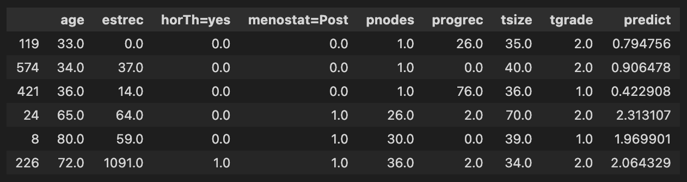

# Survival Model for Breast Cancer

Survival model with Random Survival Forest, Support Vector Machine, Gradient Boosted Model and Neural Network

Survival analysis is a branch of statistics for analyzing the expected duration of time until one event occurs, such as death in biological organisms and failure in mechanical systems. To demonstrate how to create survival models, we are going to use data from the German Breast Cancer Study Group (GBSG-2) on the treatment of node-positive breast cancer patients. The dataset can be loaded as part of sksurv.datasets 

It contains data on 686 women and 8 prognostic factors: 
1. age
2. estrogen receptor (estrec)
3. whether or not a hormonal therapy was administered (horTh)
4. menopausal status (menostat)
5. number of positive lymph nodes (pnodes)
6. progesterone receptor (progrec)
7. tumor size (tsize)
8. tumor grade (tgrade)

## Goal
1. Identify the risk score of each patient
2. Predict the time to the next recurrence of the cancer cell
3. Identify factors contributing to the risk of recurrence of the cancer cell

## Model to test
1. __Random Survival Forest:__ 

As it’s popular counterparts for classification and regression, a Random Survival Forest is an ensemble of tree-based learners. A Random Survival Forest ensures that individual trees are de-correlated by - building each tree on a different bootstrap sample of the original training data, and -at each node, only evaluate the split criterion for a randomly selected subset of features and thresholds. Predictions are formed by aggregating predictions of individual trees in the ensemble.

2. __Support Vector Machine__

Its main advantage is that it can account for complex, non-linear relationships between features and survival via the so-called kernel trick. A kernel function implicitly maps the input features into high-dimensional feature spaces where survival can be described by a hyperplane. This makes Survival Support Vector Machines extremely versatile and applicable to a wide a range of data. A popular example for such a kernel function is the Radial Basis Function.

Survival analysis in the context of Support Vector Machines can be described in two different ways:

- As a ranking problem: the model learns to assign samples with shorter survival times a lower rank by considering all possible pairs of samples in the training data.

- As a regression problem: the model learns to directly predict the (log) survival time.

In both cases, the disadvantage is that predictions cannot be easily related to standard quantities in survival analysis, namely survival function and cumulative hazard function. Moreover, they have to retain a copy of the training data to do predictions.

3. Gradient Boosted Model

Gradient Boosting does not refer to one particular model, but a versatile framework to optimize many loss functions. It follows the strength in numbers principle by combining the predictions of multiple base learners to obtain a powerful overall model. The base learners are often very simple models that are only slightly better than random guessing, which is why they are also referred to as weak learners. The predictions are combined in an additive manner, where the addition of each base model improves (or “boosts”) the overall model.
A gradient boosted model is similar to a Random Survival Forest, in the sense that it relies on multiple base learners to produce an overall prediction, but differs in how those are combined. While a Random Survival Forest fits a set of Survival Trees independently and then averages their predictions, a gradient boosted model is constructed sequentially in a greedy stagewise fashion.

4. Neural network 

Neural network provides 2 solution to approach survival modelling - the continuous-time model (DeepSurv) and the discrete-time model (DeepHit) using pycox based on the PyTorch environment.
- DeepSurv is a deep feed-forward neural network which predicts the effects of a patient's covariates on their hazard rate parameterized by the weights of the network
- The DeepHit application uses a deep neural network to learn the distribution of survival times directly. DeepHit makes no assumptions about the underlying stochastic process and allows for the possibility that the relationship between covariates and risk(s) changes over time

## Results

### Model performance
To evaluate the model, we use [concordance index](https://proceedings.neurips.cc/paper/2007/file/33e8075e9970de0cfea955afd4644bb2-Paper.pdf). The higher the concordance index, the better the model

- Random forest: 0.676
- Gradient boosted model (Cox's partial likelighood): 0.665
- __Gradient boosted model (AFT): 0.691__
- SVM (ranking): 0.676
- SVM (regression): 0.684
- Neural Network (DeepSurv): 0.666

### Risk score:
Gradient Boosted Model has the best performance with concordance index of 0.691. Using this model, we pick 6 examples to make predictions

## Conclusion

## References
- Gradient Boosted Model: https://scikit-survival.readthedocs.io/en/stable/user_guide/boosting.html
- Random Survival Forest: https://scikit-survival.readthedocs.io/en/stable/user_guide/random-survival-forest.html
- Survival Support Vector Machine: https://scikit-survival.readthedocs.io/en/stable/user_guide/survival-svm.html
- Neural Network with DeepHit and Deep Surv: https://towardsdatascience.com/how-to-implement-deep-neural-networks-for-time-to-event-analyses-9aa0aeac4717